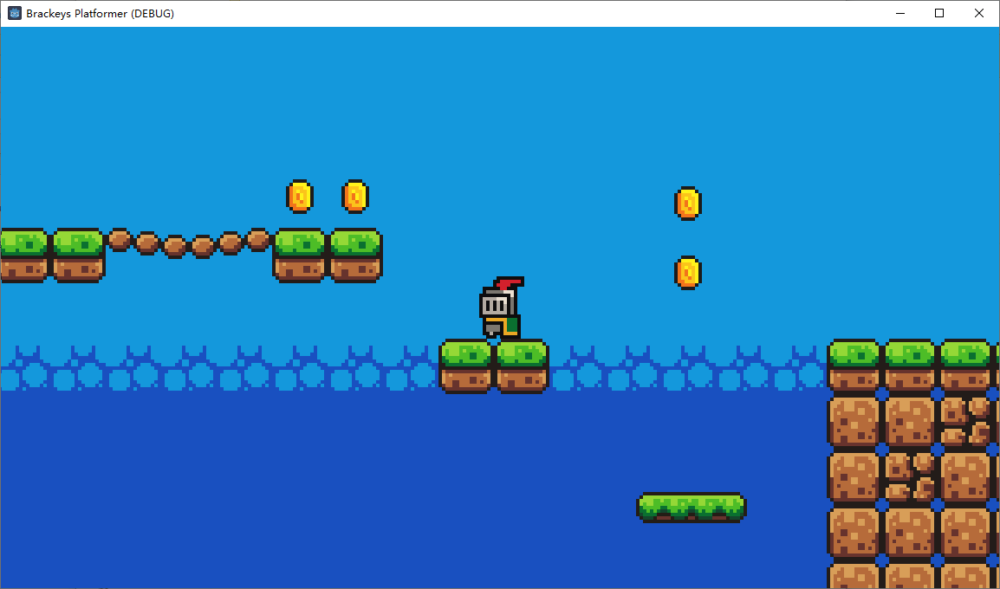

# Godot-Platformer-Demo
 My first godot game made following Brackey's tutorial!

 The excellent tutorial is [here](https://www.youtube.com/watch?v=LOhfqjmasi0&t=3s), and the [original project](https://github.com/Brackeys/first-game-in-godot) is also available. I changed the GDScript codes into C# on Godot 4.2.2.

